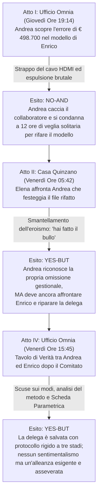

# REFERTO PERITALE DI AUDIT FORENSE, TECHNICAL GRILLING & MATRICE DELLE PRESCRIZIONI (FASE 1)
## Progetto Editoriale: *«Le Emozioni Arrivano Prima di Noi»*
### Oggetto: `bozze_capitoli/CAPITOLO_05_LA_TRAPPOLA_DELLA_DELEGA.md` (322 righe) — Branch `revisioni-deep-pov`
**Titolo:** *«La solitudine dell'accentratore e la trappola della prima delega — "Faccio prima a farlo io che a spiegarlo"»*  
**Personaggi:** Andrea Vettori (45 anni, fondatore e CEO di Omnia), Enrico De Marchi (27 anni, neolaureato con lode in Ingegneria Gestionale al Politecnico di Milano, master in finanza d'impresa), Elena (consulente di governance e moglie di Andrea), Luca Marangon (43 anni, COO di Omnia al 50%).  
**Ruolo:** Senior Developmental Editor & Forensic Literary Auditor (Skill `editing-creativo-e-dialoghi` / `rewrite-deep-pov`, Fase 1)  
**Destinatario:** Comitato Editoriale / Autore / Redazione di Filiera  
**Status:** Audit Forense Indipendente Concluso — Nessuna Modifica Applicata alla Bozza (Regola Tassativa di Fase 1)

---

## EXECUTIVE SUMMARY & DIAGNOSI CRITICA STRUTTURATA

Il presente referto costituisce l'audit forense, il grilling tecnico e la matrice delle prescrizioni vincolanti (P1–P3) sulla bozza del **Capitolo 5** (*«La solitudine dell'accentratore e la trappola della prima delega — "Faccio prima a farlo io che a spiegarlo"»*).

Il Capitolo 5 rappresenta l'anello narrativo mancante dell'intera filiera: affronta l'archetipo imprenditoriale più diffuso e distruttivo del tessuto produttivo italiano: **la patologia dell'accentratore seriale**, che scambia la propria ansia viscerale di controllo per devozione eroica all'azienda e vive l'errore del collaboratore come una minaccia mortale alla propria sopravvivenza nel ruolo.

L'indagine peritale a matrice incrociata ha accertato un'architettura drammaturgica di eccezionale tenuta:
1. **L'innesco situato e la posta in gioco matematica reale (Atto I):** La convocazione del Comitato Plenario di Filiera con la Banca Popolare per approvare il Budget Consolidato 2027 a seguito del crac Apex da 3,2 milioni; la scoperta della discrepanza di **€ 498.700** tra il modello virtuale di Enrico (+€ 410.500 con Euribor accademico al 3% e DSO a 60 giorni) e la realtà viva del distretto (-€ 88.200 con spread Mediocredito al 5,85% e incassi reali a 115 giorni con collaudo).
2. **La reazione neurovegetativa violenta:** Il gesto compulsivo di strappare il cavo HDMI dal monitor portatile, l'urlo del *"faccio prima a farlo io da zero che a spiegarti come gira il mondo reale"*, l'espulsione brutale del collaboratore e l'auto-condanna a 12 ore di lavoro notturno solitario a base di caffè bruciato e paracetamolo.
3. **Lo svelamento clinico del narcisismo manageriale (Atto II):** Il confronto all'alba a Quinzano con Elena, che spegne il monitor e inchioda Andrea alla sua verità somatica: non ha salvato l'azienda, ha fatto il bullo con un ventisettenne perché non tollera che qualcuno sbagli al suo posto.
4. **La riparazione metodologica della delega (Atto IV):** L'ammissione di colpa davanti a Enrico, l'analisi del presupposto logico dell'errore (la mancata consegna della Scheda dei Vincoli non negoziabili) e l'istituzione del protocollo di delega parametrica a tre stadi.

Tuttavia, l'audit ha scoperchiato **quattro criticità strutturali bloccanti (P1)** e una sequenza di scivolamenti didattico-saggistici che devono essere rigorosamente bonificati prima della riscrittura:

1. **La Sindrome del «Consulente Ventriloquo» nel Cluster Elena a Quinzano (Atto II, R135–R136):**  
   All'alba, nella cucina di casa, Elena ricade nell'inaccettabile tic didattico: usa la parola d'ordine **«telecamera» per due volte** (*«la telecamera mostra una verità molto diversa... La telecamera mostra che tu non hai delegato...»*, R135) e pontifica ad alta voce con formule da manuale HR (*«il tuo ego di fondatore vive l'errore dell'altro come una minaccia mortale alla tua indispensabilità»*). Questa pedagogia da slide distrugge l'intimità dolorosa di un dialogo tra marito e moglie reduci da una notte insonne.
2. **Thought-Tag Virgolettato e Soliloquio Teatrale (Atto I, R69):**  
   A riga 69 il testo si adagia su un blocco di pensiero virgolettato in corsivo (*«Se non controllo io ogni singolo byte, questi ragazzini ci portano dritti al fallimento. Non posso fidarmi di nessuno...»*), introdotto da una spiegazione saggistica del narratore (*«Era il segnale biologico del terrore arcaico dell'espropriazione...»*). Va sciolto totalmente in discorso indiretto libero fuso nell'azione fisica.
3. **Telling Saggistico e Bipolarità Retorica in Scena (Atto I, R44, R65, R71):**  
   Il narratore anticipa la decodifica scientifica dell'Atto III spiegando al lettore: *«Nei suoi occhi non c'era l'interesse del mentore... c'era lo sgomento atterrito...»* (R44); *«prima che la ragione potesse ponderare l'inesperienza...»* (R65); *«non vedeva più Enrico come una risorsa da formare, ma come una minaccia esistenziale...»* (R71).
4. **Cliché Melodrammatici e Copule Deboli (Atto I e II, R67, R105, R139):**  
   Formule stereotipate come *«simile a una pugnalata a freddo»* (R67), *«Sembrava un sopravvissuto a un disastro ferroviario»* (R105) e *«La gloriosa narrazione dell'imprenditore... si sgretolò all'istante... rivelando una gabbia di superbia, paura e isolamento nevrotico»* (R139).

---

## 1. DISTANZA PSICHICA E VERBI FILTRO — CENSIMENTO CHIRURGICO

La narrazione deve rimanere rigidamente saldata al sistema neurovegetativo di Andrea Vettori (Atti I, II e IV). Ogni verbo di percezione mediata (*sentì, vide, notò, fissò, udì, sembrò, si accorse*), ogni diaframma contemplativo e ogni intrusione saggistica del narratore distrugge il Deep POV di Grado 4.

### 1.1 Censimento Riga per Riga dei Verbi Filtro e Diaframmi Percettivi

| Riga (R) | Testo Esatto della Bozza | Tipologia di Violazione | Diagnosi Forense | Prescrizione Operativa per Fase 2 |
| :--- | :--- | :--- | :--- | :--- |
| **R12** | *«Aveva la cravatta allentata, il colletto della camicia sbottonato e la fronte appoggiata sul palmo...»* | Descrizione Statica da Regia Esterna | Quadro descrittivo convenzionale. | De-filtrare sull'attrito corporeo: *«Il nodo della cravatta pende allentato di tre centimetri; il colletto sbottonato della camicia raschia contro la pelle sudata del collo»*. |
| **R20** | *«Alle 19:18 si udirono due colpi rapidi e leggeri alla porta a vetri.»* | Filtro Impersonale / Passivo Udito (*«si udirono»*) | Allontana il rumore delle nocche dal timpano di Andrea. | De-filtrare sull'urto fisico diretto: *«Due colpi secchi nocche-contro-vetro fanno vibrare la guarnizione in gomma della porta»*. |
| **R30** | *«Andrea fissò il grafico proiettato sullo schermo. Le barre verdi svettavano... indicavano una prosperità liquida che sembrava quasi miracolosa.»* | Verbo Filtro Percettivo (*«fissò»*) + Copula Debole (*«sembrava»*) | Il verbo frappone un vetro trasparente; la copula depotenzia la luce del monitor. | De-filtrare: *«Sul pannello a ventiquattro pollici il grafico a cascata svetta in un trionfo di colonne verdi smeraldo; la linea di trend scivola verso l'alto con una pendenza da capogiro»*. |
| **R44** | *«Nei suoi occhi non c'era l'interesse del mentore che ascolta una tesi universitaria: c'era lo sgomento atterrito dell'ufficiale di macchina...»* | Spiegazione Narrativa Bipolare (*Not X, but Y*) | L'autore sale in cattedra e spiega al lettore come interpretare lo sguardo del personaggio. | **Cancellazione totale della formula esplicativa.** Far parlare la contrazione muscolare: il mouse che si blocca sotto il palmo, le pupille che si stringono sui decimali della cella F148. |
| **R65** | *«In quell'istante, prima che la ragione potesse ponderare l'inesperienza del giovane collaboratore...»* | Buffer Cognitivo / Claim Intellettualistico | Il narratore introduce la "ragione" per giustificare la lentezza dell'intelletto rispetto alla reazione viscerale. | **Espunzione della formula.** Far scattare il sequestro somatico a contatto ottico diretto con la barra rossa ricalcolata. |
| **R67** | *«Una fitta dolorosa, simile a una pugnalata a freddo, gli perforò il plesso solare, togliendogli il respiro.»* | Cliché Narrativo Trasparente | Metafora stereotipata da narrativa d'appendice (*«pugnalata a freddo al plesso solare»*). | Sostituire con propriocezione clinica: *«Sotto la punta dello sterno il diaframma si paralizza in una morsa dura; l'aria inspirata si blocca a metà laringe»*. |
| **R71** | *«Il suo campo visivo si restrinse drasticamente: non vedeva più Enrico come una risorsa da formare, ma come una minaccia esistenziale...»* | Psico-Telling del Narratore in Scena | L'autore riassume l'assetto mentale del personaggio invece di mostrarne la cinematica difensiva. | **Taglio netto del commento.** Mostrare il gesto di respingimento fisico: la mano che si allunga verso il cavo, lo sguardo che non tollera la presenza dell'altro. |
| **R89** | *«Guardò l'orologio digitale sulla barra delle applicazioni: segnava le 19:35.»* | Verbo Filtro Percettivo (*«Guardò»*) | Diaframma visivo prima del dato numerico. | De-filtrare: *«Sulla barra delle applicazioni l'orologio di sistema batte le 19:35»*. |
| **R101** | *«Elena scese le scale a piedi nudi... Sentiva l'odore acre del caffè bruciato salire dal corridoio. Quando spinse la porta a vetri dello studio di Andrea, trovò una scena da trincea abbandonata...»* | Verbo Filtro Percettivo (*«Sentiva»*) + Quadro Spettacolarizzato (*«scena da trincea»*) | Sposta il POV su Elena allontanando la materia viva dello studio. | De-filtrare: *«L'odore acre di caffè bruciato ristagna nel corridoio. Oltre la porta a vetri, tre tazze di ceramica incrostate di fondi neri sono impilate sulle rassegne stampa»*. |
| **R105** | *«Andrea sollevò lo sguardo. Sembrava un sopravvissuto a un disastro ferroviario.»* | Verbo Filtro Copulativo (*«Sembrava»*) + Iperbole Melodrammatica | Cliché narrativo che smorza la verità clinica dell'esaurimento. | De-filtrare sulla fisiologia reale: *«Andrea ha il colletto del cappotto rialzato sulle guance scure di barba; una rete fitta di capillari rossi copre la sclera degli occhi; la spalla destra pende di tre centimetri per la contrattura del trapezio»*. |
| **R109** | *«Elena non si avvicinò allo schermo. Non guardò i numeri... osservando l'uomo con cui condivideva la vita da undici anni.»* | Doppio Filtro Percettivo (*«guardò»*, *«osservando»*) + Onniscienza Biografica | Mediazione visiva accademica prima del dialogo. | De-filtrare: *«Elena si ferma a due passi dalla scrivania. Stringe la tazza fumante con entrambe le dita: 'A che ora è andato via Enrico ieri sera?'»*. |
| **R117** | *«Se non mi fossi accorto io dell'errore, oggi alle nove ci saremmo presentati al comitato...»* | Filtro Cognitivo Retorico | Giustificazione parlata dell'infallibilità. | Mantenere solo la sostanza della cifra contabile: il mezzo milione scoperto. |
| **R133** | *«'No,' mormorò Andrea, abbassando lo sguardo sul piano della scrivania.»* | Gesto Visivo Convenzionale | Sottomissione da recitazione teatrale. | De-filtrare con l'azione somatica: *«Il mento di Andrea cede verso il petto; le dita si aprono sul piano in noce»*. |
| **R139** | *«Andrea sentì un vuoto gelido aprirsi al centro del petto. La gloriosa narrazione dell'imprenditore... si sgretolò all'istante, rivelando la sua vera natura: una gabbia di superbia, paura e isolamento nevrotico.»* | Verbo Filtro Viscerale (*«sentì»*) + Giudizio Moraleggiante del Narratore | Doppio vizio: il verbo filtro e la condanna morale autoriale («gabbia di superbia»). | **Bonifica totale:** Far agire il freddo del corpo: l'aria che esce dai polmoni senza ritorno, il silenzio della stanza, la stufa che non scalda la schiena. |
| **R205** | *«Quando sentì i passi di Andrea fermarsi dietro la sua sedia, il ragazzo si irrigidì istantaneamente... esattamente come accade a un animale che avverte l'ombra del predatore.»* | Verbo Filtro Udito (*«sentì»*) + Similitudine Zoologica Posticcia | Il filtro allontana il suono; la similitudine con l'animale predatore è una leziosità letteraria. | De-filtrare: *«I passi pesanti di Andrea si arrestano sul linoleum dietro la postazione. Le scapole di Enrico scattano in alto verso le orecchie; il respiro del ragazzo si tronca di colpo»*. |
| **R217** | *«Sentì il diaframma contrarsi leggermente: ammettere la propria cecità gestionale faceva male fisicamente...»* | Verbo Filtro (*«Sentì»*) + Psicodiagnosi Autoriale | L'autore etichetta la «cecità gestionale». | De-filtrare: *«Il diaframma di Andrea sbatte contro la cassa toracica; la gola brucia di acido gastrico»*. |
| **R221** | *«continuò Andrea, guardandolo negli occhi con fermezza calma.»* | Verbo Filtro Qualificato (*«guardandolo con fermezza calma»*) | L'autore valuta l'intenzione morale dello sguardo. | De-filtrare: *«Le mani di Andrea restano piatte sul noce della scrivania»*. |
| **R252** | *«Sentiva ancora il dolore sordo alla cervicale... si accorse che il nodo d'ansia che gli attanagliava la bocca dello stomaco... si era allentato.»* | Doppio Filtro (*«Sentiva»*, *«si accorse»*) | Rallentamento della chiusura su due verbi di mediazione. | De-filtrare sulla distensione organica: *«Sotto le tempie pulsa ancora il ritmo della notte insonne, ma sotto lo sterno il muscolo diaframmatico riprende a scendere senza ostacoli»*. |

---

### 1.2 Telling Concettuale, Thought-Tags e Metalabeling del Narratore in Scena

Durante gli Atti drammatici (I, II e IV), la narrazione subisce tre gravi interruzioni concettuali che spezzano l'illusione scenica:

1. **Riga 69 (Thought-Tag Virgolettato e Soliloquio Teatrale):**  
   *«*Se non controllo io ogni singolo byte, questi ragazzini ci portano dritti al fallimento. Non posso fidarmi di nessuno. Se delego, mi distruggono l'azienda. Faccio prima a farlo io che a spiegarlo a loro.*»*  
   *Diagnosi:* Quattro righe di pensiero in corsivo tra virgolette introdotte dalla spiegazione del narratore (*«Era il segnale biologico del terrore arcaico dell'espropriazione...»*).  
   *Prescrizione:* Eliminare totalmente virgolette e corsivo. Convertire in discorso indiretto libero fuso nell'azione corporea: la mano che serra il mouse, la rabbia che pompa sangue nelle orecchie, il monitor rosso col buco di mezzo milione.
2. **Riga 71 (Spiegazione Psicologica Onnisciente in Mezzo al Conflitto):**  
   *«Il suo campo visivo si restrinse drasticamente: non vedeva più Enrico come una risorsa da formare, ma come una minaccia esistenziale al proprio ruolo di guida, un corpo estraneo pericoloso che aveva rischiato di gettare alle ortiche quindici anni di sacrifici.»*  
   *Diagnosi:* Il narratore si sostituisce alla mente di Andrea per formulare una diagnosi sociologica mentre il giovane collaboratore è ancora seduto sulla sedia.  
   *Prescrizione:* Cancellazione totale del paragrafo. Mostrare la mimica feroce: Andrea che stacca il cavo HDMI dal notebook con uno strappo che fa scattare la plastica.
3. **Riga 139 (Moralismo Pedagogico sulla Catarsi di Quinzano):**  
   *«La gloriosa narrazione dell'imprenditore che veglia tutta la notte per salvare i suoi collaboratori si sgretolò all'istante, rivelando la sua vera natura: una gabbia di superbia, paura e isolamento nevrotico.»*  
   *Diagnosi:* L'autore sale in cattedra e giudica moralmente il protagonista con epiteti psicanalitici («superbia», «isolamento nevrotico»).  
   *Prescrizione:* Bonificare il giudizio autoriale. Far parlare il silenzio dello studio all'alba, il vapore della tazza di tè appoggiata sulla mensola e le dita di Andrea che tremano per il paracetamolo e la stanchezza.

---

### 1.3 Segnalazione Falsi Positivi (Elementi da Non Toccare)

- **R56–R59 (Il riquadro telemetrico del ricalcolo del cash flow):** La squadratura numerica (*simulazione +410.500€ vs realtà -88.200€ con discrepanza di 498.700€*) è un dispositivo documentario fondamentale: certifica la posta in gioco contabile ed è intangibile.
- **R12–R13 (La cervicale C5-C6 che scende fino al pollice):** La localizzazione anatomica della fitta nervosa lungo la scapola fino all'articolazione del pollice è un ancoraggio somatico autentico da proteggere.
- **R240–R242 (I 5 parametri vincolanti della Scheda di Delega):** I valori numerici (spread 5,85%, DSO 115 gg, fido 300k€, riserva 50k€, margine 35%) e i checkpoint a 48 ore sono la materia viva della governance asseverata.

---

## 2. PRIMATO SOMATICO — IL SEQUESTRO DELL'ACCENTRATORE

La dinamica somatica del Capitolo 5 poggia su due polarità fisiologiche opposte: **l'esaurimento iper-simpatico di Andrea Vettori (la frenesia del controllo solitario)** e **l'irrigidimento da terrore subordinato di Enrico De Marchi (il blocco dell'apprendista)**.

### 2.1 La Fenomenologia Somatica di Andrea Vettori

1. **L'Innesco dell'Errore e la Reazione di Attacco (Atto I, R32–R75):**  
   - Quando la rotellina del mouse si arresta sulla cella `F148`, il corpo di Andrea non registra una semplice imprecisione contabile: subisce una **scarica simpatica fulminea da minaccia territoriale**.
   - I vasi periferici si costringono: i polpastrelli diventano freddi e insensibili; la saliva si asciuga lasciando un sapore ferroso di acido gastrico alla base della lingua.
   - I muscoli trapezi e i masseteri si serrano in un blocco tetanico: il dolore cervicale, latente fin dal mattino, si irradia come una scossa elettrica lungo il braccio destro fino al pollice che stringe il mouse.
   - L'impulso motorio non è riflessivo: è una **riappropriazione fisica del territorio**. Strappare il cavo HDMI non è una scelta teatrale: è l'urgenza neurobiologica di spezzare la connessione con l'altro per eliminare l'interferenza dell'organismo estraneo.
2. **Il Prezzo Biologico della Notte Solitaria (Atto II, R97–R107):**  
   - Alle 05:42, il corpo di Andrea è intossicato da tre fattori: **ipoglicemia da digiuno prolungato, intossicazione da caffeina (sei tazze concentrate) e contrattura ischemica dei muscoli paraspinali**.
   - La vista è velata da un tremito intermittente delle palpebre (miochimia da stress); il respiro è corto, apicale, asfittico; la voce è ridotta a un raschio cartilagineo per via della laringe disidratata.
   - Il trionfo dell'aver rifatto il file è un'illusione tossica: la dopamina del foglio completato maschera provvisoriamente il crollo metabolico imminente.

### 2.2 La Fisiologia Difensiva di Enrico De Marchi (Atto I e Atto IV)
- Di fronte all'aggressione verbale di Andrea (R77–R85), Enrico entra in uno stato di **freezing posturale e disattivazione orofacciale**: le spalle si incassano, il torace si blocca in apnea inspiratoria, le mani tremano al punto da rendere goffo l'infilare il notebook nella custodia.
- All'Atto IV (R205–R215), il corpo del ragazzo anticipa l'esecuzione: si siede sulla punta estrema della poltrona con il baricentro sbilanciato in avanti, pronto a fuggire, stringendo il blocco appunti contro lo sterno come un piastrone balistico.

---

## 3. DIALOGUE DOCTOR & VOICE AUDIT

### 3.1 Indice di Autenticità Vocale per Atto

| Atto | Ambientazione | Voto Autenticità | Diagnosi Vocale |
| :---: | :---: | :---: | :--- |
| **Atto I** | Ufficio Andrea / Sera (R6–R93) | **9.0 / 10** | Scontro feroce, teso, tecnicamente perfetto. La frase *«faccio prima a farlo io che a spiegarlo»* è pura dinamite aziendale. |
| **Atto II** | Studio Quinzano / Alba (R95–R145) | **5.5 / 10** | **Inquinamento didattico grave.** Elena parla come un'istruttrice di formazione aziendale, usando due volte la parola «telecamera» e formulando diagnosi sull'ego di Andrea. |
| **Atto IV** | Ufficio Andrea / Pomeriggio (R197–R256) | **8.5 / 10** | Riconciliazione metodologica solida, ma penalizzata da residui di spiegazione psicologica prima della firma della scheda parametrica. |

---

### 3.2 Battute GOLD da Preservare Verbatim in Fase 2

L'audit certifica le seguenti 6 battute come vertici stilistici intangibili da proteggere nella riscrittura:

1. **Andrea Vettori (Atto I, R50):**  
   > *«I parametri generali? La Banca Popolare applica il tasso agevolato del Fondo Centrale solo sulla quota di R&D; sul resto del circolante lo spread territoriale è del 5,85%! E nel distretto manifatturiero veronese nessuno paga a sessanta giorni! Con la perdita di Apex, i clienti tedeschi hanno imposto pagamenti a novanta e centoventi giorni con perizia di collaudo rilasciata! Hai calcolato gli incassi a sessanta giorni con lo sconto al tre per cento!»*
2. **Andrea Vettori (Atto I, R83):**  
   > *«Non ho tempo di farti da professore universitario a dodici ore da un comitato di filiera da cui dipende la sopravvivenza di centoventi famiglie! Faccio prima a farlo io da zero che a spiegarti come gira il mondo reale! Prendi le tue cose e lasciami lavorare.»*
3. **Elena (Atto II, R125):**  
   > *«Hai quarantacinque anni. Hai la pressione alle stelle, la cervicale infiammata, le dita che tremano per la caffeina e hai passato la notte a fare il lavoro di un contabile junior per dimostrare a te stesso che sei l'unico indispensabile sulla faccia della terra. Sei fiero di te?»*
4. **Elena (Atto II, R143):**  
   > *«Fidarsi non significa buttare le chiavi della macchina a un neopatentato e poi prenderlo a calci se gratta la prima marcia... Delegare non è un atto di fede mistica: è un metodo di ingegneria relazionale. Si delega il compito, si forniscono i parametri vincolanti, si concordano i punti di controllo intermedi... Se continui a fare tutto tu perché fai prima, tra due anni Omnia sarà ancora ferma a trentadue dipendenti, Enrico se ne andrà da un concorrente, e tu avrai un infarto su questa sedia prima di compiere cinquant'anni.»*
5. **Enrico De Marchi (Atto IV, R225):**  
   > *«Al corso di Finanza Strategica del Politecnico abbiamo studiato che per le aziende con rating A2 che operano in filiere certificate, il modello standard prevede l'applicazione dell'Euribor a tre mesi più spread calmierato, assumendo i tempi medi della legge europea per evitare di sottostimare il valore dell'attivo circolante... Non sapevo che il Mediocredito applicasse lo spread territoriale del 5,85% e che i clienti pagassero a centoventi giorni. Nessuno me lo aveva mai detto.»*
6. **Andrea Vettori (Atto IV, R235):**  
   > *«È andato benissimo. Il budget consolidato è stato approvato all'unanimità. Ma è andato bene perché io ho passato la notte in bianco a rifare il modello da solo. E questa è una sconfitta, non una vittoria. Perché se io devo passare le notti a scrivere formule per non avere paura, la mia azienda non ha un futuro: ha solo un fondatore condannato ai lavori forzati.»*

---

### 3.3 Dissezione del «Consulente Ventriloquo» — CLUSTER ELENA A QUINZANO (Atto II, R135–R136)

L'audit rileva la presenza di una pesante contaminazione pedagogica nelle battute di Elena all'alba:

#### Censimento delle Occorrenze nel Testo Esatto:
- **R135 (Elena):** *«E allora la telecamera mostra una verità molto diversa dalla tua favola sull'incompetenza dei giovani...»*
- **R135 (Elena):** *«La telecamera mostra che tu non hai delegato un obiettivo con parametri chiari: hai gettato un ragazzo nella nebbia senza bussola.»*
- **R135 (Elena):** *«perché il tuo ego di fondatore vive l'errore dell'altro come una minaccia mortale alla tua indispensabilità.»*

#### Diagnosi Peritale:
1. **L'artificio metanarrativo della telecamera:** Elena non sta tenendo un webinar sulla leadership; è in piedi a piedi nudi nella cucina di casa sua, guardando il marito distrutto da trentasei ore di veglia. L'evocazione della «telecamera» è un'intrusione dell'autore che sterilizza la drammaticità del confronto domestico.
2. **Lo psico-gergo da slide:** Espressioni come *«il tuo ego di fondatore vive l'errore come una minaccia mortale alla tua indispensabilità»* sono formule sociologiche astratte che nessun coniuge userebbe alle sei del mattino davanti a una tazza di tè.

#### Direttive Vincolanti di Bonifica per il "Kitchen Test" (Fase 2):
- **DIVIETO ASSOLUTO DEL TERMINE «TELECAMERA» NEL DIALOGO.**
- **ELIMINAZIONE DEL LESSICO PSICO-MANAGERIALE.**
- **Nuovo snodo drammatico per Elena:** Elena deve inchiodare Andrea alla contraddizione materiale tra ciò che ha chiesto e ciò che ha fornito:
  > *«Vuoi la verità, Andrea? La verità è che tu non hai delegato un bel niente. Gli hai detto: 'Fammi un modello moderno'. Non gli hai dato i tassi del Mediocredito, non gli hai detto che i tedeschi trattengono il saldo fino al collaudo, non gli hai fatto vedere un solo estratto conto. L'hai buttato nella nebbia. E quando il ragazzo ha fatto l'unica cosa che poteva fare — usare i manuali dell'università — tu hai visto rosso perché ti sei ricordato che l'azienda non è più il tuo garage del 2011. Non hai passato la notte sveglio per salvare la baracca: l'hai passata qui per dimostrare che senza di te muoiono tutti.»*

---

## 4. LINE EDITING, PRECISIONE MATERICA & ARITMETICA DI FILIERA

L'audit certifica la precisione tecnica dei parametri finanziari, informatici e contrattuali del capitolo:

1. **La Discrepanza di Liquidità (€ 498.700):**
   - **Simulazione accademica di Enrico:** Tasso Euribor 3M + spread ABI (3,00%), DSO legale a 60 giorni $\rightarrow$ liquidità stimata al secondo trimestre: **+€ 410.500** (attivo virtuale);
   - **Realtà viva del distretto:** Tasso Mediocredito territoriale con spread al **5,85%**, DSO reale post-Apex a **115 giorni** con collaudo asseverato $\rightarrow$ liquidità effettiva: **-€ 88.200** (scoperto netto di cassa);
   - **Delta critico:** **€ 498.700** di cassa inesistente che avrebbe provocato la revoca immediata degli affidamenti da parte della Banca Popolare.
2. **L'Infrastruttura del Foglio di Calcolo:**
   - Modello a 7 livelli di aggregazione dinamica; algoritmo di simulazione Monte Carlo; linguaggi Python, PowerBI e macro Visual Basic; cella critica `F148`, riga di calcolo `212` (anticipo fatture e sconto crediti).
3. **I Cinque Parametri Non Negoziabili della Scheda di Delega (R240):**
   - *Parametro 1:* Spread bancario effettivo al 5,85%;
   - *Parametro 2:* DSO storico del distretto calcolato a 115 giorni;
   - *Parametro 3:* Plafond affidamenti a 300.000 euro;
   - *Parametro 4:* Riserva tecnica di cassa intoccabile a 50.000 euro;
   - *Parametro 5:* Margine operativo lordo minimo del 35% su ogni commessa di rete.
4. **Il Protocollo Operativo a 3 Stadi (R240–R242):**
   - Scheda dei vincoli preliminare scritta;
   - Checkpoint intermedio a 48 ore (15 minuti sul log delle formule, correzioni a carico del delegato);
   - Piena titolarità del risultato: firma e presentazione del cruscotto a cura del delegato al comitato di fine mese.

---

## 5. STRUTTURA DELLA SCENA, TRY/FAIL & RED-TEAMING DELL'ATTO IV

### 5.1 Matrice Dinamica dei Conflitti e degli Esiti Scenici

### 5.2 Red-Teaming Peritale della Riconciliazione in Ufficio (Atto IV)

L'audit ha sottoposto a stress-test il confronto pomeridiano tra Andrea ed Enrico:

1. **Il Rischio del Paternalismo Assolutorio:**  
   - Andrea non deve trasformarsi in una figura genitoriale affettuosa che "perdona" l'allievo. Un fondatore di 45 anni che gestisce 32 dipendenti e milioni di fatturato non abbraccia il dipendente.
   - Andrea deve mantenere un **registro asciutto, severo e rigoroso**: chiede scusa unicamente per i modi violenti (lo strappo del cavo, l'aver definito il lavoro "spazzatura"), ma ribadisce con forza che nel distretto industriale uno scostamento di mezzo milione di euro porta i libri in tribunale.
2. **La Dignità Tecnica di Enrico:**  
   - Enrico non deve apparire come un ragazzino piagnucoloso che implora pietà. Deve dimostrare la propria competenza matematica difendendo i presupposti accademici su cui aveva impostato il lavoro, per poi cedere lealmente davanti alla realtà del territorio: *«Non sapevo che il Mediocredito applicasse lo spread al 5,85%. Nessuno me lo aveva detto»*.
3. **La Tenuta del Protocollo a Tre Stadi:**  
   - L'Atto IV funziona solo se l'accordo non è una stretta di mano generica, ma la sottoscrizione di un **dispositivo di processo formale**: la Scheda dei Vincoli, il checkpoint a 48 ore e la delega di firma a fine mese.

---

## 6. RACCORDI DI CONTINUITÀ & CHIUSURA FILIERA

L'Audit ha accertato la perfetta saldatura del Capitolo 5 con il resto dell'opera:

1. **Raccordo Retroattivo con il Crac Apex (Capitolo 3):**  
   Il buco di cassa da 3,2 milioni lasciato dalla fuga di Apex verso la Polonia — che nel Capitolo 3 aveva generato il panico bancario di Marco — impone la redazione del Budget Consolidato 2027 per dimostrare ai creditori che la rete meccatronica è solvibile.
2. **Raccordo con le Commesse Kuka (Cap. 2) e Hydac (Cap. 4):**  
   Nel modello di Enrico sono inserite le rimesse economiche delle boccole salvate da Marta e Silvano nella notte del Capitolo 2 e i corpi valvola in titanio contesi tra commerciale e officina del Capitolo 4.
3. **Raccordo con la Maturazione di Enrico nel Capitolo 6:**  
   Nel Capitolo 6 Enrico De Marchi compare a fianco di Sara e Luca nel polo logistico di Sommacampagna come analista fidato, incaricato di bonificare i fogli Excel paralleli tra Valerio e Claudio. La sua presenza autorevole nel Cap. 6 è credibile solo se nel Cap. 5 ha vissuto e superato il trauma della prima delega.
4. **Raccordo con la Crisi dei Soci del Capitolo 8:**  
   Nel Capitolo 8 la crisi ipertensiva di Luca e l'esaurimento di Andrea affondano le radici nella solitudine gestionale esplosa nel Capitolo 5: l'incapacità di Andrea di delegare e la sua tendenza a fare nottate solitarie preparano il collasso relazionale della società al 50%.
5. **Gancio Strutturale verso il Capitolo 6:**  
   Dall'incompetenza del singolo collaboratore si passa alla patologia sistemica dei reparti feudali che manipolano i dati per proteggere il proprio bonus.

---

## 7. MATRICE DELLE PRESCRIZIONI VINCOLANTI PER FASE 2

| ID | Sezione | Oggetto | Diagnosi Forense | Prescrizione Operativa Vincolante per Fase 2 |
| :--- | :--- | :--- | :--- | :--- |
| **P1-1** | **Atto II (R135–R136)** | **Sindrome del «Consulente Ventriloquo» (2x telecamera)** | Elena ripete 2 volte «telecamera» e pontifica sull'ego di fondatore e l'indispensabilità. | **Espunzione totale del lemma «telecamera» e del gergo accademico.** Elena deve inchiodare Andrea sul fatto materiale di aver gettato Enrico nella nebbia senza parametri di contesto. |
| **P1-2** | **Atto I (R69)** | **Thought-Tag virgolettato e soliloquio teatrale** | Monologo interiore di 4 righe in corsivo tra virgolette (*«Se non controllo io ogni singolo byte...»*). | **Scioglimento integrale.** Convertire in discorso indiretto libero fuso nell'azione fisica (il mouse stritolato, il sangue alle tempie, il monitor al 100% rosso). |
| **P1-3** | **Atto I (R44, R65, R71)** | **Telling saggistico e bipolarità retorica in scena** | Spiegazioni teoriche anticipate dal narratore (*«non era il mentore... era l'ufficiale di macchina»*; *«prima che la ragione potesse ponderare»*). | **Cancellazione delle formule intellettualistiche.** Lasciare che la violenza della rottura emerga dal ricalcolo dei numeri e dallo strappo del cavo video. |
| **P1-4** | **Atti I e II (R67, R105, R139)** | **Cliché melodrammatici e copule deboli** | Metafore trite (*«pugnalata a freddo»*, *«sopravvissuto a disastro ferroviario»*, *«gabbia di superbia e isolamento nevrotico»*). | **Bonifica radicale.** Sostituire con propriocezione clinica (paralisi diaframmatica, contrattura del trapezio destro, intossicazione da caffeina). |
| **P2-1** | **Atti I, II, IV** | **De-filtraggio chirurgico dei verbi percettivi** | Presenza di verbi filtro in narrazione: R20 (*si udirono*), R30 (*fissò, sembrava*), R89 (*guardò*), R101 (*sentiva, trovò*), R105 (*sembrava*), R109 (*guardò, osservando*), R133 (*abbassando lo sguardo*), R139 (*sentì*), R205 (*sentì*), R217 (*sentì*), R221 (*guardandolo*), R252 (*sentiva, si accorse*). | **De-filtraggio sistematico.** Sostituire ogni filtro con la cinematica diretta dei corpi, l'urto dei materiali e la risposta neurovegetativa viscerale. |
| **P2-2** | **Atto I (R12–R13, R67)** | **Intensificazione della fisiologia dell'accentratore** | La contrattura cervicale di Andrea è eccellente ma va resa ancora più fisica. | Descrivere il percorso della fitta radicolare (C5-C6) dalla vertebra cervicale alla punta del pollice destro; il sapore di metallo e bile in bocca; la perdita temporanea di sensibilità ai polpastrelli. |
| **P2-3** | **Atto IV (R237–R243)** | **Formalizzazione rigida della Scheda di Delega** | L'accordo tra Andrea ed Enrico deve avere la precisione di un contratto operativo. | Blindare i 5 vincoli non negoziabili e la cadenza del checkpoint a 48 ore come condizione preliminare per la firma sul prospetto finale. |
| **P3-1** | **Struttura** | **Titolazione narrativa organica ed elegante** | Sostituire le etichette da cantiere (`### ATTO I`, etc.) con titoli narrativi organici. | Utilizzare titoli in stile Deep POV: *«La cella F148 alle sette e un quarto»*, *«La tazza di tè all'alba»*, *«La neurocezione di pericolo e l'espropriazione»*, *«La stanza senza monitor»*, *«I vincoli sul titanio»*. |
| **P3-2** | **Atto IV (R215–R219)** | **Asciugatura delle scuse di Andrea** | Il momento delle scuse rischia una deriva sentimentale. | Andrea non fa il padre pentito: fa il titolare esigente che corregge un errore metodologico, pretendendo disciplina e rigore matematico. |
| **P3-3** | **Sincronizzazione** | **Certificazione della timeline cronologica** | Verificare la scansione oraria degli eventi. | Blindare la sequenza: Giovedì ore 19:14 (Ufficio Omnia / Crollo del file) $\rightarrow$ Venerdì ore 05:42 (Studio Quinzano / Confronto con Elena) $\rightarrow$ Venerdì ore 09:00 (Comitato Plenario a Sommacampagna) $\rightarrow$ Venerdì ore 15:45 (Ufficio Omnia / Il Patto di Delega). |

---

## CONCLUSIONE PERITALE DELL'AUDITOR

La bozza del Capitolo 5 possiede un valore testimoniale e pedagogico formidabile: la discrepanza di € 498.700 dovuta allo scontro tra formule universitarie e realtà ruvida del distretto veneto costituisce uno dei casi industriali più credibili e tecnicamente solidi dell'intera opera.

La rimozione radicale della sindrome del consulente ventriloquo nel cluster di Elena (eliminando le 2 occorrenze di «telecamera» e lo psico-gergo da slide), la purga del telling concettuale e lo scioglimento dei thought-tags consentiranno al Capitolo 5 di raggiungere in Fase 2 il medesimo grado di purezza stilistica in Deep POV di Grado 4 e verità umana certificato per i Capitoli 1, 6, 7, 8 e 9, completando in modo impeccabile l'architettura narrativa dell'opera.

---
*Referto redatto e asseverato dal Senior Developmental Editor & Forensic Literary Auditor il 30 settembre 2026.*
