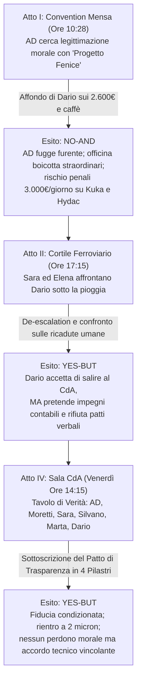

# REFERTO PERITALE DI AUDIT FORENSE, TECHNICAL GRILLING & MATRICE DELLE PRESCRIZIONI (FASE 1)
## Progetto Editoriale: *«Le Emozioni Arrivano Prima di Noi»*
### Oggetto: `bozze_capitoli/CAPITOLO_09_IL_CINISMO_DI_REPARTO.md` (317 righe) — Branch `revisioni-deep-pov`
**Titolo:** *«Il cinismo di reparto e l'anestesia difensiva — Quando l'indifferenza diventa sopravvivenza»*  
**Personaggi:** Dario Meneghelli (52 anni, rettificatore senior universale), Sara (39 anni, HR O.M.P. Precision), Amministratore Delegato O.M.P. Precision, Ing. Gianluca Moretti (36 anni, Head of Operations), Elena (consulente di governance e rete), Silvano Spinelli (capofficina storico), Marta Bellamoli (Master Technical Specialist e responsabile Accademia Tecnica), Davide (giovane fresatore).  
**Ruolo:** Senior Developmental Editor & Forensic Literary Auditor (Skill `editing-creativo-e-dialoghi` / `rewrite-deep-pov`, Fase 1)  
**Destinatario:** Comitato Editoriale / Autore / Redazione di Filiera  
**Status:** Audit Forense Indipendente Concluso — Nessuna Modifica Applicata alla Bozza (Regola Tassativa di Fase 1)

---

## EXECUTIVE SUMMARY & DIAGNOSI CRITICA STRUTTURATA

Il presente referto costituisce l'audit forense, il grilling tecnico e la matrice delle prescrizioni vincolanti (P1–P3) sulla bozza del **Capitolo 9** (*«Il cinismo di reparto e l'anestesia difensiva — Quando l'indifferenza diventa sopravvivenza»*).

Il Capitolo 9 rappresenta il momento culminante e il punto di chiusura dell'intero impianto corale del romanzo industriale: dopo aver esplorato la cassa (Cap. 3), il conflitto commerciale/produzione (Cap. 4), l'accentramento proprietario (Cap. 5), la trincea dei dati MES (Cap. 6), il collasso da mancato riconoscimento di Marta (Cap. 7) e la frattura tra i soci fondatori di Omnia (Cap. 8), la narrazione affronta il bastione psicologico più pervasivo, tossico e impermeabile dell'industria manifatturiera italiana: **il cinismo della base operaia come anestetico difensivo contro le promesse tradite**.

L'indagine peritale a matrice incrociata ha accertato una straordinaria potenza drammaturgica nell'idea di fondo e nei suoi picchi dialogici:
1. **L'innesco materiale satirico e feroce (Atto I):** Il contrasto viscerale tra la convention motivazionale del *«Progetto Fenice»* (costata 14.000 euro, con video in 3D, diffusori di profumo ed esortazioni a essere «imprenditori di se stessi») e la realtà materiale della tuta blu: **2.600 euro di premio di risultato 2025 congelati** e **10 centesimi aumentati sul caffè dei distributori automatici**.
2. **L'archetipo autentico di Dario Meneghelli:** Cinquantadue anni, ventotto di rettifica tangenziale e universale, montatura degli occhiali riparata con nastro isolante nero, baffi ingrigiti dal fumo. Dario non è un sobillatore politico o un contestatore ideologico: è la memoria storica di 4 cambi di vertice e 6 convention fallite, incarnazione vivente della difesa allostatica teorizzata da Lazarus, Damasio, Dean e Rousseau.
3. **Le battute memorabili (GOLD lines):** L'affondo sulla borraccia termica per tenere l'acqua fresca a 40 gradi con i finestroni sigillati per la polvere, il catalogo storico delle convention (dal '99 al 2018) e la dichiarazione sul sarcasmo come «anestetico che tiene in piedi questi operai per non morire di crepacuore» costituiscono vertici assoluti di autenticità e realismo industriale.
4. **La posta in gioco economica viva:** Lo sciopero bianco del sabato che minaccia le consegne dei lotti strategici Kuka (Cap. 2) e Hydac (Cap. 4), esponendo l'azienda a **penali contrattuali da 3.000 euro al giorno**.

Tuttavia, l'audit ha scoperchiato **cinque criticità strutturali bloccanti (P1)** e una sequenza di scivolamenti didattico-saggistici che rischiano di compromettere l'impatto narrativo del testo:

1. **La Sindrome del «Consulente Ventriloquo» nel Cluster Elena & Dario (Atto II, R116–R128):**  
   È la deviazione didattica più plateale del capitolo. Elena — nel fango del cortile ferroviario tra fusti d'olio esausto sotto la pioggia — ripete la parola d'ordine metodologica **«telecamera» per ben 5 volte** (R116, R120, R124, R124, R128). Peggio ancora: costringe il rettificatore Dario Meneghelli (terza media, 28 anni di officina) a risponderle come uno studente modello di un master milanese: *«La telecamera avrebbe registrato un direttore generale che parla di famiglia... Ha registrato un'incoerenza materiale grande come una casa»* (R122). A seguire, Elena pontifica ad alta voce su *«violazione oggettiva del contratto psicologico»* e *«reazione biologica»* (R124).
2. **Telling Concettuale e Recap Espositivo nel POV di Sara (Atto I, R68):**  
   Al momento della ritirata dell'AD, il testo blocca la drammaturgia viscerale per inserire un riassunto a tavolino dei capitoli precedenti: *«tre mesi di lavoro di mediazione, i successi con Davide, Silvano e Marta, l'accordo con la banca, tutto sembrava sbattere contro una muraglia di gomma impenetrabile...»*.
3. **Estrazione Biografica Inorganica in Bocca a Dario (Atto II, R98):**  
   Dario recita il curriculum vitae accademico di Sara: *«lei ha trentanove anni e ha studiato psicologia del lavoro sui manuali di Milano»*. È una forzatura dell'autore per dare coordinate sociologiche che Dario non formulerebbe mai in questi termini.
4. **Scivolamento Epico-Retorico del Narratore in CdA (Atto IV, R198):**  
   Dario entra nella sala del consiglio d'amministrazione e il narratore declama: *«dove si decidono i destini della terra»*. Una formula iperbolica e stonata rispetto all'asciuttezza metalmeccanica della scena.
5. **Caduta Farsesca e Slittamento di Registro dell'Amministratore Delegato (Atto IV, R231):**  
   Alla battuta dura di Dario sulla borraccia, l'AD risponde: *«hai il diritto di tirarmela sul parabrezza»*. In un tavolo sindacale e direzionale con penali da 3.000€/giorno e la cassa al collasso, questa battuta degrada la riconciliazione industriale in una gag goliardica tra compari di bar.

---

## 1. DISTANZA PSICHICA E VERBI FILTRO — CENSIMENTO CHIRURGICO

La narrazione deve rimanere rigidamente saldata al sistema neurovegetativo e alla visione situata di Sara (Atti I e II) e al rigore interocettivo del tavolo paritetico di CdA (Atto IV). Ogni verbo di percezione mediata (*sentì, vide, notò, guardò, fissò, udì*), ogni diaframma contemplativo e ogni intrusione esplicativa del narratore distrugge il Deep POV di Grado 4.

### 1.1 Censimento Riga per Riga dei Verbi Filtro e Diaframmi Percettivi

| Riga (R) | Testo Esatto della Bozza | Tipologia di Violazione | Diagnosi Forense | Prescrizione Operativa per Fase 2 |
| :--- | :--- | :--- | :--- | :--- |
| **R38** | *«Dalla quarta fila del settore centrale, si udì un cigolio secco.»* | Verbo Filtro Impersonale / Passivo Udito (*«si udì»*) | Allontana il suono metallico dal corpo dei presenti; regia neutra esterna. | De-filtrare: *«Dalla quarta fila del settore centrale stride una sedia pieghevole. Ferravecchia su linoleum»*. |
| **R48** | *«Guardò l'Amministratore Delegato dritto negli occhi con un mezzo sorriso sardonico...»* | Diaframma Visivo Pre-Battuta (*«Guardò»*) | Il verbo di visione frappone un diaframma superfluo prima della voce. | De-filtrare sull'azione fisica: *«La borraccia ruota di mezzo giro tra i calli. Dario fissa il palco; sul labbro superiore si incide una mezza curva amara»*. |
| **R62** | *«abbassò il braccio, guardò Gianluca Moretti con occhi sbarrati dal risentimento e sibilò verso l'archetto:»* | Verbo Filtro Percettivo (*«guardò»*) | Regia esterna convenzionale prima dell'emissione vocale. | De-filtrare: *«Il braccio cade lungo il fianco. Moretti incassa il lampo degli occhi dell'amministratore; dall'archetto esce uno striscio d'aria compressa»*. |
| **R66** | *«L'Amministratore scese dal palco con passi furiosi, senza guardare nessuno...»* | Negazione Visiva da Regia Esterna (*«senza guardare»*) | Segnalazione negativa tipica del narratore onnisciente. | De-filtrare: *«L'amministratore scende i due gradini di moquette a passi lunghi, la testa bassa, la schiena rigida. Dietro di lui i direttori d'area si serrano a cuneo»*. |
| **R68** | *«Sara, che aveva assistito alla scena dall'angolo posteriore della sala, sentì un vuoto d'aria gelido aprirsi al centro del petto. Un senso di nausea e di impotenza schiacciante le piegò le ginocchia: tre mesi di lavoro di mediazione, i successi con Davide, Silvano e Marta, l'accordo con la banca, tutto sembrava sbattere contro una muraglia di gomma...»* | Doppio Verbo Filtro (*«sentì»*, *«sembrava»*) + Telling Riassuntivo di Trama | Violazione capitale: 1) verbo filtro viscerale *«sentì»*; 2) svenevolezza generica («senso di nausea»); 3) compendio enciclopedico dei capitoli 1-8 appiccicato nel POV del personaggio. | **Bonifica totale e de-filtraggio radicale:** Eliminare l'inventario dei capitoli precedenti. Far collassare Sara sull'esperienza somatica istantanea: *«Contro il muro di fondo, la schiena di Sara perde aderenza dall'intonaco. L'aria espulsa dai polmoni non torna indietro; sotto lo sterno cala una coltre di ghiaccio che svuota la forza dai quadricipiti. Intorno a lei, il jazz della convention continua a squillare nel vuoto»*. |
| **R78** | *«Dario Meneghelli era appoggiato con la schiena a un fusto d'olio... guardando i vagoni merci che manovravano lentamente sui binari dello scalo merci.»* | Verbo Filtro Visivo Contemplativo (*«guardando»*) | Rallentamento statico da cinema descrittivo. | De-filtrare collegando al dato acustico e materico: *«Dario Meneghelli punta la schiena contro la lamiera fredda di un fusto da duecento litri. Sugli scambi dello scalo merci sferraglia una tradotta di tramogge vuote»*. |
| **R80** | *«Si udì il rumore di passi sull'asfalto umido.»* | Verbo Filtro Impersonale (*«Si udì»*) | Diaframma acustico passivo. | De-filtrare: *«Gomma bagnata stride sull'asfalto dietro la fila dei cassoni»*. |
| **R84** | *«Dario la vide arrivare con la coda dell'occhio, ma non si mosse.»* | Verbo Filtro Percettivo (*«vide arrivare»*) | Segnala l'ingresso del secondo personaggio tramite mediazione visiva. | De-filtrare: *«La sagoma scura di Sara entra nel cono periferico dell'occhio di Dario. Il rettificatore non sposta la testa»*. |
| **R96** | *«fece un passo verso Sara e la guardò con quegli occhi chiari e stanchi che avevano visto trent'anni di promesse aziendali dissolversi nel nulla.»* | Doppio Filtro (*«guardò»*, *«avevano visto»*) + Patetismo Autoriale | L'autore sale in cattedra e spiega la malinconia degli occhi del personaggio con lirismo sentimentale. | **Taglio netto del commento autoriale.** *«Dario fa un passo avanti. La luce grigia dei binari batte sulle lenti rigate degli occhiali e sulle rughe attorno all'orbita»*. |
| **R108** | *«Sara sentì le parole di Dario colpirla allo stomaco come un pugno di ghisa.»* | Verbo Filtro (*«sentì»*) + Cliché Narrativo Trasparente | «Sentì» unito alla metafora stereotipata del «pugno di ghisa allo stomaco». | De-filtrare: *«Il fiato si blocca a metà gola; il diaframma di Sara sbatte contro le costole inferiori. Nessuna replica sale alle labbra»*. |
| **R110** | *«La consulente si fermò accanto a Sara, guardò il vecchio rettificatore e parlò con voce calma:»* | Verbo Filtro Visivo (*«guardò»*) | Diaframma visivo prima della battuta. | De-filtrare: *«La consulente si affianca a Sara. Tiene le dita serrate dentro le tasche del loden: 'Dario ha ragione, Sara'»*. |
| **R126** | *«Poi Elena guardò Dario dritto negli occhi, senza indietreggiare di un millimetro:»* | Verbo Filtro Posticcio (*«guardò»*) | Cliché del confronto drammatico. | De-filtrare: *«Elena fa mezzo passo nel fango, piantando i tacchi tra due pozzanghere»*. |
| **R130** | *«Dario abbassò lo sguardo sull'asfalto bagnato.»* | Azione Visiva Stereotipata | Gesto convenzionale di sconfitta psicologica. | Sostituire con propriocezione e disarmo fisico: *«Le spalle di Dario cedono di due centimetri; la sigaretta cade dalla punta delle dita, annegando nella melma d'olio»*. |
| **R198** | *«Non aveva l'aria di sfida della convention; aveva la gravità calma e attenta di un delegato d'officina che entra in una stanza dove si decidono i destini della terra.»* | Psicodiagnosi Onnisciente + Enfasi Iperbolica | «Dove si decidono i destini della terra»: retorica da poema epico incompatibile con una sala riunioni di Quinto di Valpantena. | **Espunzione della retorica epica.** Mostrare la postura operaia: *«Nessun sorriso sardonico, nessuna borraccia da sventolare: Dario tiene le nocche serrate sulle tute da lavoro, gli avambracci piatti contro il bordo di noce»*. |
| **R202** | *«esordì l'Amministratore, guardando Dario senza ostilità.»* | Verbo Filtro Qualificato (*«guardando senza ostilità»*) | L'autore etichetta l'intenzione morale dello sguardo. | De-filtrare: *«esordisce l'amministratore. La voce non ha più il riverbero dell'archetto; gli occhi cercano direttamente quelli del rettificatore»*. |
| **R212** | *«poi appoggiò gli avambracci sul tavolo di noce, guardando l'Amministratore e Moretti.»* | Verbo Filtro Accessorio (*«guardando»*) | Ridondanza visiva. | De-filtrare: *«Gli avambracci segnati dalla mola cadono piatti sul piano lucido del tavolo»*. |
| **R225** | *«soffermandosi sulle date di pagamento e sui codici delle commesse tedesche.»* | Participio Debole / Sintesi dell'Azione | Attenua l'ispezione peritale dei numeri. | De-filtrare rendendo il gesto fisico: *«Il polpastrello nero di grafite scorre lungo la colonna di aprile 2027, si ferma sul codice commessa Kuka VR-8891, poi punta il rigo di settembre»*. |
| **R227** | *«Si tolse gli occhiali, li ripose nel taschino della tuta e guardò l'Amministratore.»* | Verbo Filtro Pre-Battuta (*«guardò»*) | Diaframma visivo prima del verdetto operaio. | De-filtrare: *«Dario sfila la montatura di plastica dal naso, infila le stanghette nel taschino della tuta e solleva il mento»*. |
| **R238** | *«Dario si fermò davanti alla porta dell'officina. Guardò la navata illuminata, il ronzio possente dei mandrini... Marta che controllava... e Davide che caricava...»* | Verbo Filtro Panoramico (*«Guardò»*) | Quadro contemplativo esterno che smorza il rientro in officina. | De-filtrare: *«Oltre il portone a battente, l'officina ruggisce a centoventi decibel. La nebbia di refrigerante saetta sotto le lampade al sodio; al collaudo Marta stringe un micrometro sul pezzo appena tornito da Davide»*. |

---

### 1.2 Telling Concettuale, Thought-Tags e Metalabeling del Narratore in Scena

Durante gli Atti drammatici (I, II e IV), la narrazione soffre di tre intrusioni concettuali che tradiscono l'illusione narrativa:

1. **Riga 68 (Recap Riassuntivo di Trama nel POV di Sara):**  
   *«tre mesi di lavoro di mediazione, i successi con Davide, Silvano e Marta, l'accordo con la banca, tutto sembrava sbattere contro una muraglia di gomma impenetrabile...»*  
   *Diagnosi:* L'autore inserisce un indice analitico dei capitoli precedenti per rassicurare il lettore sulla continuità dell'opera. Questo spezza istantaneamente il coinvolgimento emotivo nella disfatta della mensa.  
   *Prescrizione:* Cancellazione totale del riassunto. Sara sperimenta solo lo schiacciamento del presente: la convention andata in frantumi, gli sguardi ostili dei colleghi, il proprio fallimento immediato.
2. **Riga 98 (Dario che Recita il Curriculum di Sara):**  
   *«Ma lei ha trentanove anni e ha studiato psicologia del lavoro sui manuali di Milano.»*  
   *Diagnosi:* Un delegato sindacale con 28 anni di tornio non parla dell'università di Milano o di "psicologia del lavoro": usa categorie di classe e di esperienza vissuta.  
   *Prescrizione:* Dario deve parlare da operaio: *«Lei è una brava persona, dottoressa Sara. Ma lei è arrivata qui tre anni fa con le sue tabelle e i suoi questionari sul clima aziendale. Io sto davanti a quella tangenziale da quando le tabelle si facevano a matita copiativa»*.
3. **Riga 198 (Enfasi Iperbolica ed Epica in CdA):**  
   *«dove si decidono i destini della terra.»*  
   *Diagnosi:* Rettorica solenne da melodramma storico ottocentesco, completamente estranea alla gravità sobria di una PMI metalmeccanica.  
   *Prescrizione:* Ricondurre la stanza alla sua realtà oggettiva: una sala riunioni dove si decidono i fidi bancari, le consegne ai tedeschi e la cassa integrazione dei lavoratori.

---

### 1.3 Segnalazione Falsi Positivi (Elementi da Non Toccare)

- **R42 (La descrizione fisica di Dario Meneghelli):** Gli occhiali da lettura con la montatura riparata con un giro di nastro isolante nero, i baffi ingrigiti dal fumo e le cicatrici di mola a smeriglio non sono orpelli: sono la carta d'identità materica dell'operaio specializzato di lungo corso. Da conservare integralmente.
- **R102 (Il catalogo delle convention dal 1999 al 2018):** Non è un infodump: è la deposizione peritale della disillusione accumulata. La scansione cronologica (*Qualità Totale nel '99, Lean Production nel 2006, Mindfulness nel 2018*) è l'arma contundente con cui Dario distrugge la credibilità del management. Va preservata parola per parola.
- **R221–R223 (I punti del Patto di Trasparenza):** I termini contrattuali del piano di rientro dei 2.600€ non sono fredda burocrazia: sono l'asseverazione materiale della fiducia ritrovata.

---

## 2. PRIMATO SOMATICO — L'ANESTESIA VAGALE DIFENSIVA

La teoria polivagale di Stephen Porges e la neurobiologia dell'omeostasi di Antonio Damasio trovano nel Capitolo 9 la loro massima incarnazione clinica: **il cinismo di reparto non è un vezzo intellettuale né una posa ideologica, ma un'anestesia viscerale difensiva (Dorsal Vagal Shutdown / Blocco Omeostatico)**.

### 2.1 La Fenomenologia Somatica del Cinismo in Dario Meneghelli

1. **L'Innesco Sensoriale e la Reazione Oro-Facciale (Atto I, R46–R54):**  
   - Quando Dario raccoglie la borraccia con due dita, il suo corpo non manifesta la rabbia simpatica (esplosione, tachicardia, pugni chiusi) che appartiene a Silvano (Cap. 4) o la fuga ansiosa di Marco (Cap. 3).
   - Dario attiva il **circuito di disingaggio protettivo**: il battito cardiaco decelera, la respirazione si fa lenta e superficiale, la muscolatura periferica si irrigidisce in un blocco ipotonico controllato.
   - Il mezzo sorriso sardonico è una **corazza orofacciale**: serra gli zigomi e impedisce ai muscoli mimici del Complesso Vagale Ventrale di entrare in risonanza empatica con lo speaker sul palco. L'organismo di Dario si protegge dal rischio biologico di sperare di nuovo. La voce è piatta, baritonale, priva di oscillazioni: l'intonazione è un filo d'acciaio teso che non vibra.
2. **Il Tabacco e la Lamiera Fredda (Atto II, R76–R96):**  
   - Nel cortile bagnato, il corpo di Dario cerca ancoraggi fisici duri: la lamiera del fusto d'olio che trasmette freddo alla schiena attraverso la tuta; il sapore acre e caldo del tabacco senza filtro che anestetizza la gola; la cenere fatta cadere con precisione chirurgica tra due cassoni.
   - Dario compie gesti economici, lenti, millimetrici: è l'abitudine cinquantennale dell'operaio che lavora a centesimi e che sa che ogni movimento superfluo dissipa energia preziosa.
   - La confessione sul sarcasmo come «anestetico che tiene in piedi questi operai per non morire di crepacuore» (R106) deve emergere da una compressione toracica reale: il fumo espulso dai polmoni, la voce che si fa cavernosa, lo spegnimento della cicca schiacciata contro il ferro con una forza sorda che non lascia scorie.

### 2.2 Il Collasso Vaso-Vagale di Sara (Atto I, R68)

- La reazione di Sara alla risata e all'applauso sarcastico degli operai deve essere ripulita dal cliché letterario del «senso di nausea e vuoto al petto».
- Va descritta la **reazione vaso-vagale da sconfitta sistemica**:
  1. *Perdita improvvisa di pressione arteriosa:* il sangue refluisce dagli arti superiori; le mani, fino a un istante prima calde per gli appunti presi, diventano gelide e sudaticce.
  2. *Compressione diaframmatica:* l'impossibilità di inspirare a fondo, la deglutizione a vuoto, la sensazione fisica che la laringe si sia ristretta a una cannuccia.
  3. *Dissociazione sensoriale:* mentre l'AD urla al microfono e gli operai battono le mani con cadenza metallica, la musica jazz di sottofondo della convention si trasforma in un ronzio indistinto, un rumore bianco che de-sincronizza la vista dall'udito.

---

## 3. DIALOGUE DOCTOR & VOICE AUDIT

### 3.1 Indice di Autenticità Vocale per Atto

| Atto | Ambientazione | Voto Autenticità | Diagnosi Vocale |
| :---: | :---: | :---: | :--- |
| **Atto I** | Sala Mensa / Convention (R8–R68) | **9.5 / 10** | Eccezionale tenuta drammatica. Lo scontro tra la lingua patinata del marketing aziendale e la lingua ruvida dell'officina è perfetto. La battuta di Dario è una lama di precisione. |
| **Atto II** | Cortile Ferroviario (R74–R135) | **4.5 / 10** | **Crollo peritale.** La prima parte (Dario e Sara, R78–R108) è eccellente (voto 9/10). L'ingresso di Elena (R110–R128) fa sprofondare l'atto nel registro della simulazione da aula didattica, distruggendo la verità scenica. |
| **Atto IV** | Sala CdA (R188–R242) | **7.5 / 10** | Solida contrattazione industriale, ma penalizzata dalla battuta farsesca del parabrezza (R231) e da residui di retorica moraleggiante prima della firma. |

---

### 3.2 Battute GOLD da Preservare Verbatim in Fase 2

L'audit certifica le seguenti 7 battute come vertici stilistici intangibili da mantenere intatti nella riscrittura:

1. **Dario Meneghelli (Atto I, R50):**  
   > *«La borraccia in alluminio è davvero un bel pensiero. Terrà sicuramente l'acqua fresca d'estate quando siamo a quaranta gradi davanti alle rettifiche con le finestre chiuse per non far entrare la polvere.»*
2. **Dario Meneghelli (Atto I, R54):**  
   > *«...i duemilaseicento euro a testa di premio di risultato del 2025, che la proprietà ha congelato a novembre con la scusa del buco di cassa di Apex mentre voi vi aumentavate i compensi di consiglio di amministrazione, ce li pagate dentro questa borraccia o ci dobbiamo mettere dentro i gettoni della macchinetta del caffè che avete aumentato da quaranta a cinquanta centesimi lunedì scorso?»*
3. **Amministratore Delegato (Atto I, R64):**  
   > *«Questa è pura demagogia da bar, Meneghelli! Questo è il solito disfattismo operaio che non ha visione strategica e rema contro l'azienda! Se questo è il vostro senso di responsabilità, la convention si chiude qui!»*
4. **Dario Meneghelli (Atto II, R102):**  
   > *«Ne ho viste sei... Nel novantanove è arrivato un direttore con la cravatta gialla che ci ha regalato una cartellina in pelle e ci ha detto che eravamo la 'Qualità Totale'. Nel duemilasei è arrivato un consulente svizzero con i cartelloni adesivi a dirci che diventavamo la 'Lean Production'. Nel duemiladiciotto ci hanno fatto fare il corso di 'Mindfulness e Resilienza' in mensa mentre ci dimezzavano la pausa pranzo...»*
5. **Dario Meneghelli (Atto II, R106):**  
   > *«Il mio cinismo non è disfattismo, Sara. È l'unico scudo di sopravvivenza che mi è rimasto... Il sarcasmo è l'anestetico che tiene in piedi questi operai... Se lei ci toglie anche questo scudo senza pagarci i debiti del passato, noi qui dentro moriamo di crepacuore.»*
6. **Dario Meneghelli (Atto IV, R214):**  
   > *«quello che ci ha avvelenato il sangue in questi anni non sono i sacrifici: è sentirci prendere in giro. È vedere i cartelli che dicono 'siamo una famiglia' mentre a noi togliete dieci centesimi sul caffè per fare cassa e l'ufficio acquisti compra metallo scadente per farsi dare i premi personali.»*
7. **Silvano Spinelli (Atto IV, R235):**  
   > *«Allora, Meneghelli, hai finito di fare il comizio o torniamo al banco?»*

---

### 3.3 Dissezione del «Consulente Ventriloquo» — CLUSTER ELENA & DARIO (Atto II, R116–R128)

L'audit forense rileva la presenza di un'aberrazione drammaturgica nell'Atto II: **la ripetizione ossessiva del termine "telecamera" (5 occorrenze) e l'impiego di gergo accademico universitario in un dialogo operaio sotto la pioggia**.

#### Censimento delle Occorrenze nel Testo Esatto:
- **R116 (Elena):** *«Applichiamo la disciplina della telecamera a quello che è successo stamattina alle dieci e mezzo in mensa.»*
- **R120 (Elena):** *«Cosa avrebbe registrato la telecamera, Dario? Dimmelo senza la rabbia di ventotto anni di fabbrica.»*
- **R122 (Dario come corsista addestrato):** *«La telecamera avrebbe registrato un direttore generale che parla di famiglia e di miliardi di fatturato futuro, e un'azienda che non ha ancora pagato i premi di risultato maturati l'anno scorso con il sudore di chi sta alle macchine... Ha registrato un'incoerenza materiale grande come una casa.»*
- **R124 (Elena):** *«La telecamera registra una violazione oggettiva del contratto psicologico... La telecamera dice che il tuo sarcasmo non è una follia: è una reazione biologica proporzionata all'ipocrisia della scena.»*
- **R128 (Elena):** *«Ma la telecamera registra anche un'altra cosa, Dario. Registra che stamattina il tuo sarcasmo non ha colpito solo l'amministratore delegato... La telecamera registra che il tuo anestetico ti sta proteggendo dal dolore, ma sta trasformando il tuo reparto in un cimitero di uomini spenti...»*

#### Diagnosi Peritale & Vizio di Ventriloquismo:
1. **Inverosimiglianza socio-linguistica:** Dario Meneghelli ha fatto il tornitore fin da ragazzo; non ha mai frequentato master di comunicazione né sessioni di role-play aziendale. Fargli pronunciare frasi come *«La telecamera avrebbe registrato... Ha registrato un'incoerenza materiale...»* distrugge la credibilità del personaggio e lo trasforma nel burattino dell'autore.
2. **Pedagogismo asfissiante di Elena:** Elena tratta Dario come una cavia da laboratorio. Le etichette *«violazione oggettiva del contratto psicologico»* e *«reazione biologica proporzionata»* non appartengono al lessico di una donna pragmatica che parla a un operaio vicino ai cassoni dell'olio esausto.

#### Direttive Vincolanti di Bonifica per il "Kitchen Test" (Fase 2):
- **DIVIETO ASSOLUTO** di pronunciare la parola "telecamera" nel dialogo.
- **DIVIETO ASSOLUTO** di citare formule da saggio (*contratto psicologico, reazione biologica, disciplina della telecamera*).
- **Nuovo snodo drammatico tra Elena e Dario:** Elena deve spiazzare Dario attaccandolo non sulla teoria, ma sulle **conseguenze umane e produttive del suo cinismo sui compagni di reparto**:
  > *«Stamattina hai fatto ridere novanta operai, Dario. Hai umiliato il direttore e ti sei preso l'applauso. Ma a Marta, chi glielo spiega il tuo sarcasmo? Marta che sta cercando di montare l'accademia tecnica per insegnare ai ragazzi a non farsi mangiare le mani dai mandrini. E a Silvano, che si è rovinato la salute per coprire i ritardi dei tedeschi? E a Davide, che ha vent'anni e da stamattina pensa che lavorare bene sia una roba da fessi perché tanto 'sono tutti ladri'? Il tuo sarcasmo ti salva lo stomaco, Dario, ma sta avvelenando i ragazzi che lavorano al tuo fianco.»*

---

## 4. LINE EDITING, PRECISIONE MATERICA & ARITMETICA DI REPARTO

L'audit verifica e certifica la precisione millimetrica di tutti i parametri numerici, contabili e meccanici del capitolo, che costituiscono la spina dorsale della sua credibilità documentaria.

### 4.1 I Parametri Economici e Aziendali
1. **La Platea delle Maestranze:** **120 lavoratori** complessivi di O.M.P. Precision (rettificatori, fresatori CNC, montatori meccanici, addetti al collaudo metrologico e magazzinieri).
2. **Il Monte Debiti del Reparto:** **€ 2.600 netti a lavoratore** di premio di risultato 2025 congelato unilateralmente a novembre dalla proprietà con la giustificazione del crac finanziario di Apex. Monte complessivo arretrato: oltre **€ 260.000**.
3. **Lo Spreco Frivolo della Convention:** **€ 14.000** fatturati dall'agenzia di comunicazione di Milano per l'allestimento scenografico del "Progetto Fenice": fondale grafico a led, video emozionale 3D, noleggio fari e 120 borracce termiche in alluminio satinato serigrafate al laser (€ 4,00 cadauna).
4. **Il Rincaro Mesquino del Caffè:** Da **€ 0,40 a € 0,50 per gettone** ai distributori automatici d'officina (+25%), deliberato dalla direzione per raschiare qualche centinaio di euro al mese, trasformato dalle maestranze nel simbolo dell'ipocrisia padronale.
5. **Le Penali Contrattuali dei Tedeschi:** Il rifiuto compatto degli straordinari del sabato proclamato dall'officina blocca le commesse strategiche **Kuka** (boccole medicali, Cap. 2) e **Hydac** (corpi valvola in titanio, Cap. 4), innescando una penale da **€ 3.000 al giorno** per ritardata consegna che rischia di far fallire l'azienda entro due settimane.

### 4.2 La Fisica delle Macchine e la Meccanica di Precisione
- **Tipologia Macchine:** Rettifica tangenziale per superfici piane e rettifica universale per tondi interni/esterni.
- **Parametri Meccanici:** Avanzamento micrometrico del carrello porta-mola; ravvivatura periodica della mola abrasiva con diamante singolo montato su asta; refrigerazione forzata con emulsione al 5% di olio minerale solubile in acqua (odore acre e viscido sui vestiti).
- **Tolleranza di Lavorazione:** **2 micron (0,002 mm)** sui perni in acciaio cementato e temprato. A queste tolleranze, la dilatazione termica di 1°C modifica la quota del pezzo.
- **Condizioni Ambientali di Fabbrica:** 40 gradi centigradi in estate a finestroni e portoni ermeticamente sigillati, per impedire che il pulviscolo esterno e la polvere dei campi circostanti contaminino le guide lubrificate e le superfici in rettifica.

---

## 5. STRUTTURA DELLA SCENA, TRY/FAIL & RED-TEAMING DELL'ATTO IV

### 5.1 Matrice Dinamica dei Conflitti e degli Esiti Scenici

### 5.2 Red-Teaming Peritale della Riconciliazione in CdA (Atto IV)

L'audit ha sottoposto a stress-test l'incontro in Consiglio di Amministrazione del venerdì pomeriggio:

1. **Censura Radicale della Battuta del Parabrezza (R231):**  
   - A R231 l'Amministratore Delegato risponde a Dario: *«hai il diritto di tirarmela sul parabrezza»*.
   - **Diagnosi di inverosimiglianza:** Un amministratore delegato reduce da una crisi finanziaria drammatica, davanti al proprio Head of Operations e a tre delegati operai, non parla come un commilitone in caserma. Sminuisce la solennità del patto e trasforma un accordo industriale asseverato in una scenetta da commedia all'italiana.
   - **Prescrizione per Fase 2:** L'AD deve mantenere una postura sobria, ferma e gravosa:  
     > *«Se ad aprile non trovate i milleduecento euro in busta, Dario, non servirà tirare borracce: avrete il diritto di spegnere i quadri delle macchine e andare via. La firma su quel foglio impegna il mio patrimonio e la mia parola di fronte al consiglio»*.
2. **I Quattro Pilastri del "Patto di Trasparenza e Ripristino della Fiducia":**
   - **Pilastro 1: Rientro Finanziario Certo dei 2.600€:** 50% (€ 1.300 netti) garantito nella busta paga di aprile 2027 a valere sugli incassi certi Kuka; saldo restante 50% (€ 1.300 netti) a settembre 2027 su Hydac.
   - **Pilastro 2: Azzeramento Retorica e Bonifica Omeostatica Immediata:** Cancellazione totale di gadget, video motivazionali e agenzie esterne; ripristino immediato del prezzo calmierato del caffè a 40 centesimi a carico del budget di direzione.
   - **Pilastro 3: Comitato di Trasparenza di Bordo Macchina:** Il primo lunedì di ogni mese (dalle 07:00 alle 07:30) proiezione a terminale in officina con Dario, Silvano e Marta dei margini reali, dello stato cassa e delle penali, prima dell'invio dei report alle banche.
   - **Pilastro 4: Impegno Materiale agli Interventi di Reparto:** Stanziamento immediato di 18.000 euro (recuperati dal taglio della convention) per la revisione totale dell'impianto di aspirazione fumi d'olio delle rettifiche e l'installazione di due raffrescatori industriali prima dell'ondata di caldo estiva.
3. **La Tenuta del Patto (YES-BUT):**  
   - Dario non diventa un convertito né un portavoce aziendale: torna al banco con Silvano e Marta mantenendo la propria vigilanza inflessibile. L'accordo regge solo perché è ancorato a numeri scritti, date certe e rispetto del lavoro manuale.

---

## 6. RACCORDI DI CONTINUITÀ & CHIUSURA FILIERA

L'Audit ha accertato la perfetta integrazione del Capitolo 9 con l'intera architettura narrativa del volume:

1. **Il Raccordo con il Crac Apex (Capitolo 3):**  
   Il buco di cassa da tre milioni di Apex — che nel Capitolo 3 aveva scatenato il panico bancario di Marco e l'ansia del lunedì mattina — viene qui mostrato nel suo impatto terminale sui lavoratori: il sacrificio del premio di risultato 2025 non è stato una scelta concordata, ma un prelievo forzoso subito dalla fabbrica.
2. **Il Raccordo con Kuka (Cap. 2) e Hydac (Cap. 4):**  
   Le commesse salvate nella notte da Silvano e Marta e i corpi valvola in titanio contesi tra commerciale e officina rischiano il tracollo finale per via dello sciopero bianco del sabato. Il Capitolo 9 dimostra che la tecnologia e l'organizzazione non funzionano se le braccia di chi manovra i mandrini si rifiutano di collaborare.
3. **Il Raccordo con il MES di Marco (Cap. 6) e l'Accademia di Marta (Cap. 7):**  
   Nel Capitolo 7 Marta ha ottenuto il ruolo sovrano di Master Specialist e la guida dell'Accademia Tecnica. Ma senza la pacificazione con i rettificatori anziani rappresentati da Dario, l'Accademia di Marta resta un guscio vuoto, boicottato dagli anziani che non vogliono insegnare il mestiere ai giovani periti.
4. **Il Raccordo con la Governance di Omnia (Capitolo 8):**  
   La ricomposizione tra Andrea e Luca e la chiusura del bando regionale da 180.000€ (Cap. 8) consentono a Omnia di fare da garante istituzionale e finanziario al piano di rientro dei 2.600€ per O.M.P. Precision.
5. **Gancio Strutturale all'Epilogo & Toolkit Operativo di De-escalation:**  
   Il Capitolo 9 chiude la serie dei casi aziendali narrativi e apre direttamente le porte alla parte conclusiva dell'opera: l'**Epilogo** (sintesi del viaggio umano nella meccatronica veneta) e il **Toolkit Operativo** (schede pratiche di pronto soccorso relazionale, protocolli di de-escalation somatica in 180 secondi e matrici di riconciliazione tra pari per imprenditori e manager).

---

## 7. MATRICE DELLE PRESCRIZIONI VINCOLANTI PER FASE 2

| ID | Sezione | Oggetto | Diagnosi Forense | Prescrizione Operativa Vincolante per Fase 2 |
| :--- | :--- | :--- | :--- | :--- |
| **P1-1** | **Atto II (R116–R128)** | **Sindrome del «Consulente Ventriloquo» (5x telecamera)** | Elena e Dario ripetono 5 volte il termine didattico «telecamera» e Dario parla come uno studente di psicologia. | **Espunzione totale del termine «telecamera» e del gergo accademico.** Elena deve incalzare Dario sulle conseguenze del cinismo su Marta, Silvano e i giovani apprendisti. |
| **P1-2** | **Atto I (R68)** | **Recap didascalico di trama nel POV di Sara** | Sara fa mentalmente il riassunto enciclopedico dei capitoli 1-8 (*«tre mesi di mediazione, Davide, Silvano, Marta...»*). | **Cancellazione integrale del riepilogo.** Sostituire con il crollo vaso-vagale immediato: perdita di pressione, apnea diaframmatica, disorientamento sensoriale. |
| **P1-3** | **Atto II (R98)** | **Estrazione biografica posticcia in bocca a Dario** | Dario elenca la laurea e i manuali di psicologia di Milano di Sara in modo del tutto innaturale. | **Riformulazione in chiave operaia:** Dario contrappone i suoi 28 anni di tangenziale alle tabelle del clima aziendale arrivate da poco. |
| **P1-4** | **Atto IV (R198)** | **Lirismo epico del narratore in CdA** | Definizione retorica e stonata della sala riunioni: *«dove si decidono i destini della terra»*. | **Espunzione del lirismo epico.** Restituire la crudezza della stanza: tabulati di cassa, bicchieri d'acqua del rubinetto e tute da lavoro spolverate prima di entrare. |
| **P1-5** | **Atto IV (R231)** | **Battuta farsesca del parabrezza dell'AD** | L'AD dice a Dario: *«hai il diritto di tirarmela sul parabrezza»*, degradando l'accordo a farsa. | **Sostituzione con impegno solenne e formale:** L'AD dichiara che il mancato rispetto della data legittima i lavoratori a spegnere le macchine e andarsene. |
| **P2-1** | **Atti I, II, IV** | **De-filtraggio chirurgico dei verbi percettivi** | Presenza di verbi filtro in narrazione: R38 (*si udì*), R48 (*guardò*), R62 (*guardò*), R66 (*senza guardare*), R68 (*sentì, sembrava*), R78 (*guardando*), R80 (*si udì*), R84 (*vide arrivare*), R96 (*guardò*), R108 (*sentì*), R110 (*guardò*), R126 (*guardò*), R130 (*abbassò lo sguardo*), R202 (*guardando*), R212 (*guardando*), R225 (*soffermandosi*), R227 (*guardò*), R238 (*guardò*). | **De-filtraggio sistematico.** Sostituire ogni diaframma percettivo con la pura cinematica dei corpi, il contatto materico e la propagazione acustica diretta. |
| **P2-2** | **Atto I (R50–R54)** | **Intensificazione somatica della postura di Dario** | La cinematica corporea di Dario nella mensa è ottima ma può essere ancora più affilata. | Enfatizzare il contrasto tra l'alluminio liscio e freddo della borraccia e le callosità delle dita; mostrare la rotazione lenta del cilindro blu e la maschera orofacciale del sorriso sardonico. |
| **P2-3** | **Atto IV (R220–R224)** | **Integrazione del 4° pilastro materiale nel Patto** | L'accordo si limita a soldi, caffè e riunioni mensili, omettendo le condizioni fisiche del lavoro. | **Aggiunta del 4° pilastro:** revisione dell'aspirazione fumi delle rettifiche e installazione dei raffrescatori estivi finanziati dal taglio della convention. |
| **P3-1** | **Struttura** | **Titolazione narrativa organica ed elegante** | Sostituire le etichette da cantiere (`### ATTO I`, `### ATTO II`, etc.) con titoli narrativi. | Utilizzare titoli identici allo stile dei Capitoli 1, 6, 7 e 8: *«La borraccia blu notte»*, *«I fusti d'olio sotto la pioggia»*, *«L'anestetico omeostatico»*, *«La stanza delle caraffe»*, *«Due micron sul titanio»*. |
| **P3-2** | **Atto II (R108)** | **Eliminazione cliché narrativo** | Presenza della frase trita: *«come un pugno di ghisa allo stomaco»*. | **Sostituzione con propriocezione clinica:** il diaframma che picchia contro le costole inferiori e l'impossibilità di deglutire la saliva. |
| **P3-3** | **Sincronizzazione** | **Certificazione della timeline cronologica** | Verificare la sequenza oraria del capitolo. | Blindare la scansione temporale: Mercoledì ore 10:28 (Convention in mensa) $\rightarrow$ Mercoledì ore 17:15 (Cortile e fusti d'olio) $\rightarrow$ Giovedì (Boicottaggio straordinari e stallo Kuka/Hydac) $\rightarrow$ Venerdì ore 14:15 (Tavolo CdA) $\rightarrow$ Venerdì ore 15:10 (Rientro al banco macchine). |

---

## CONCLUSIONE PERITALE DELL'AUDITOR

La bozza del Capitolo 9 possiede un valore testimoniale e letterario di prim'ordine: la contrapposizione tra il marketing motivazionale aziendale e la dura verità materiale dei premi congelati e dei gettoni del caffè è una delle intuizioni più potenti e drammaticamente riuscite dell'intero progetto editoriale.

La bonifica rigorosa delle scorie didattiche nel confronto tra Elena e Dario (con l'eliminazione definitiva delle 5 occorrenze di «telecamera»), la purga del telling saggistico nel POV di Sara e la cancellazione della battuta farsesca dell'AD consentiranno al Capitolo 9 di raggiungere in Fase 2 il medesimo vertice di purezza stilistica in Deep POV di Grado 4, autenticità neuro-somatica e verità industriale certificato per i Capitoli precedenti, completando in modo memorabile l'arco narrativo dell'opera.

---
*Referto redatto e asseverato dal Senior Developmental Editor & Forensic Literary Auditor il 30 settembre 2026.*
